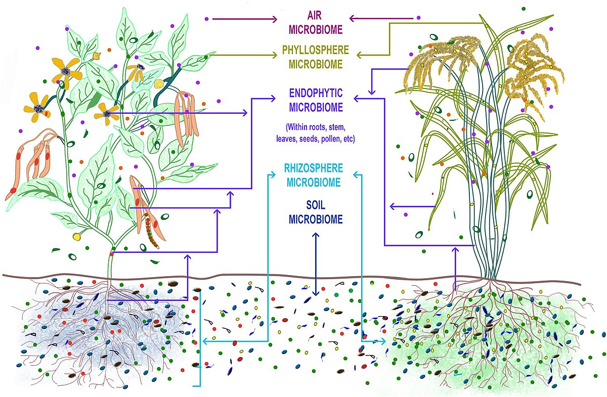

# Data Management Engineering Cookiecutter

<a target="_blank" href="https://cookiecutter-data-science.drivendata.org/">
    
</a>

Этот репозиторий содержит основной ETL-пайплайн для извлечения, трансформации и загрузки данных.

## Набор данных




Этот ETL-пайплайн обрабатывает набор данных метабаркодинга генов 16S и ITS2, связанных с анализом микробного разнообразия озимых зерновых культур (рожь, пшеница и тритикале). Понимание микробного разнообразия растений позволит в будущем манипулировать составом их микробиома для повышения урожайности и устойчивости к неблагоприятным факторам среды сельскохозяйственных культур. Наобор данных был получен из лаборатории инфекционных заболеваний растений КИББ Фиц КазНЦ РАН, образцы были секвенированы на Illumina MiSeq.

Данные состоят из нескольких файлов, включая таблицы подсчета ASV (Amplicon Sequence Variants), таксономическую классификацию и метаданные образцов.

---

## Источник данных

Все исходные "сырые" данные для этого проекта хранятся на Google Drive.

**Ссылка на Google Drive:** [https://drive.google.com/drive/folders/1Azl5tjFB47B9aBVfpBObkG4WG7ohekdS?usp=sharing](https://drive.google.com/drive/folders/1Azl5tjFB47B9aBVfpBObkG4WG7ohekdS?usp=sharing)

---

## Основной ETL-пайплайн

Пакет `etl` представляет собой конвейер для извлечения, трансформации и загрузки набора геномных данных.

## Project Organization

```
├── LICENSE
├── Makefile
├── Plant_microbiome.jpg
├── README.md
├── creds.db
├── data
│   ├── processed
│   └── raw          
├── docs
├── etl
│   ├── __init__.py  
│   ├── extract.py      # Extract from GDrive
│   ├── load.py         # Load to DB
│   ├── main.py         # The main executable file
│   └── transform.py    # Type conversion
├── models
├── notebooks
│   └── EDA.ipynb
├── poetry.lock
├── pyproject.toml
├── references
├── reports
│   └── figures
├── setup.cfg
└── tests
    └── test_data.py
```

--------

### Инструкция по запуску

Для запуска полного ETL-процесса необходимо:

Для запуска пайплайна необходимо сначала настроить окружение, а затем запустить сам скрипт.

#### Запуск ETL

```bash
# 1. Клонируйте этот репозиторий
git clone git@github.com:Konstantaza/DME-Cookiecutter.git
cd DME-Cookiecutter

# 2. Установите Poetry
pip install poetry

# 3. Создайте удобное вам коружение для работы (conda, docker и тд.)

# 4. Установите Poetry
pip install poetry

# 5. Установите все зависимости проекта
poetry install --no-root

# 6. Запустите полный ETL-процесс
poetry run python -m etl.main --step all

    # Только извлечение
    poetry run python -m etl.main --step extract

    # Только трансформация
    poetry run python -m etl.main --step transform

    # Только загрузка
    poetry run python -m etl.main --step load

```
